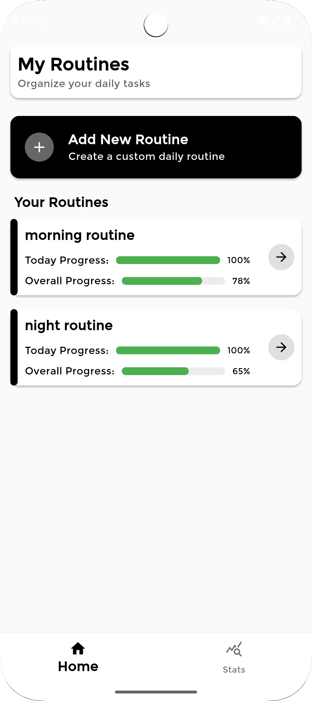
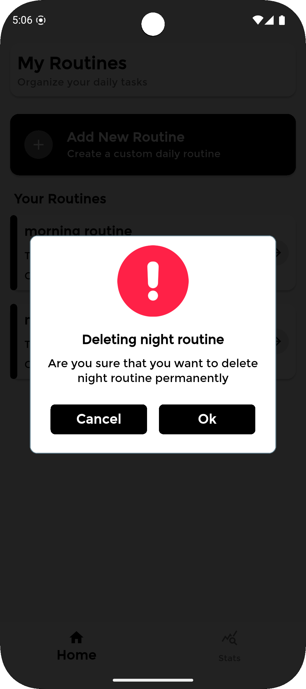
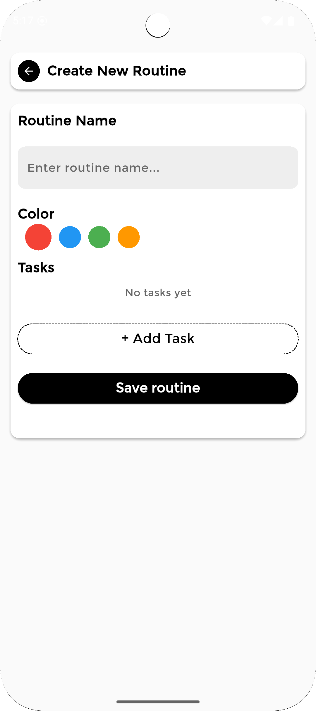
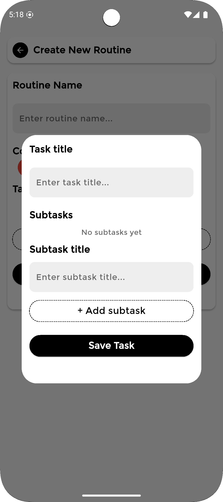
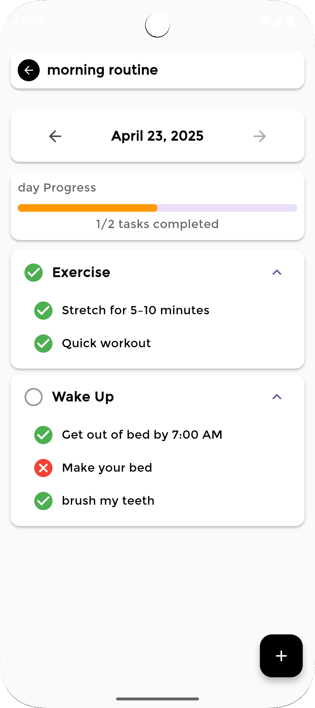
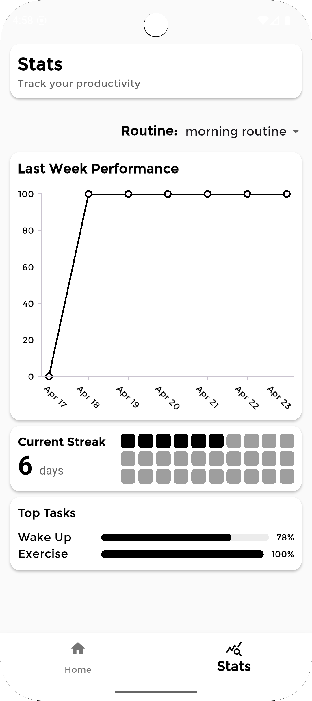

# 📆 Daily Track

**Daily Track** is a Flutter productivity app built to help users organize and maintain their everyday routines. Whether you're building new habits or keeping track of existing ones, Daily Track gives you a clear structure and insightful statistics to stay consistent and focused.

## 🚀 Features

### 🏠 Home Screen Overview
- View all your routines in one place.  
- See each routine’s:  
  - ✅ Today's progress  
  - 📊 Overall progress
   
     
       &nbsp; &nbsp; &nbsp;&nbsp;&nbsp;&nbsp;&nbsp;
        

### ✅ Routine Management
- Create daily routines to stay organized and focused.  
- Each routine is made up of multiple tasks.  
- Each task can also contain subtasks, giving you more control over your process.

  
   &nbsp; &nbsp; &nbsp;&nbsp;&nbsp;&nbsp;&nbsp;
  

### 📅 Routine Screen
- Mark tasks and subtasks as complete to track your day effectively.
- Edit tasks with changing names or adding and removeing subtasks.

  
  &nbsp; &nbsp; &nbsp;&nbsp;&nbsp;&nbsp;&nbsp;
  

### 📈 Statistics
- Analyze your **weekly performance** for each routine.  
- See your **current streaks** to stay motivated.  
- Identify your most completed tasks with the **Top Tasks** section.

  

